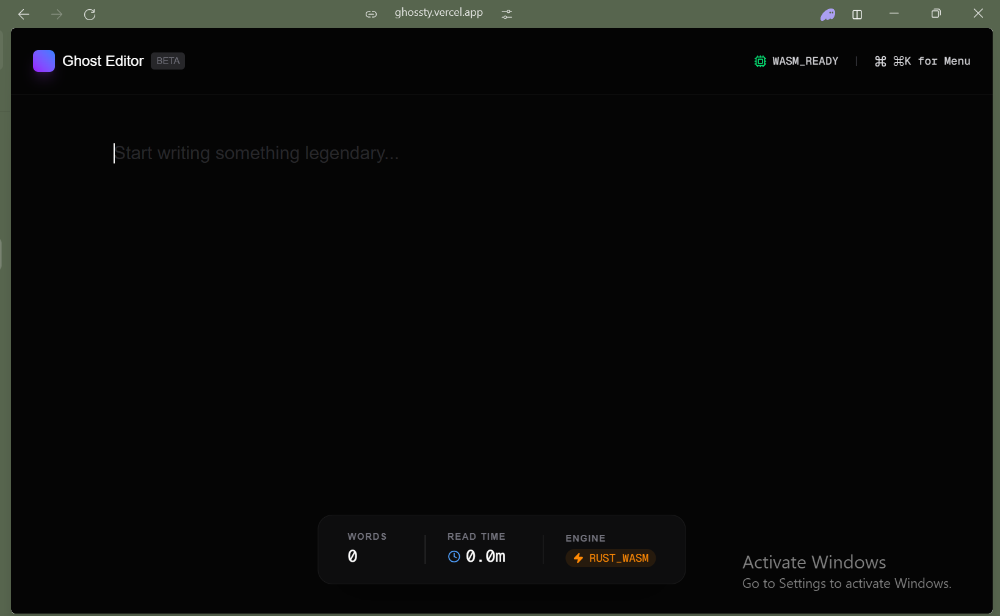

# 👻 Ghost Editor

A high-performance, minimalist text editor built for the modern web. This isn't just a React app—it’s a hybrid **Design + Systems** project utilizing a **Rust-based analysis engine** compiled to **WebAssembly**.


## 🖼️ Preview
<!-- Place the screenshot at: public/ghossty.PNG (note case) -->
<div style="max-width: 1200px; aspect-ratio: 16 / 9; overflow: hidden; border-radius: 12px; border: 1px solid #222; margin: 0;">
	
  
</div>


## 🚀 The Stack
* **Frontend:** Next.js 16 (App Router) + TypeScript
* **Styling:** Tailwind CSS + Framer Motion (60fps interactions)
* **Engine:** Rust (compiled to WASM for low-latency text processing)
* **Infrastructure:** Vercel with a custom Rust CI/CD pipeline

## 🛠️ Key Features
* **Rust-Powered Analysis:** Real-time word count, character tracking, and reading time processed in a separate WASM thread to keep the UI buttery smooth.
* **Arc-Inspired UI:** Floating glassmorphism footer and minimalist "Zen" workspace.
* **Command Palette:** `Cmd + K` interface for pro workflows.
* **Performance First:** Zero main-thread blocking even with massive text buffers.

## 📦 Project Structure
```text
├── crates/editor-engine   # 🦀 The Rust Logic (Platform)
├── pkg/                   # ⚡ The WASM/JS Bridge (Systems)
├── src/app                # 🎨 The Next.js UI (Design)
└── next.config.ts         # ⚙️ Webpack/WASM Config
